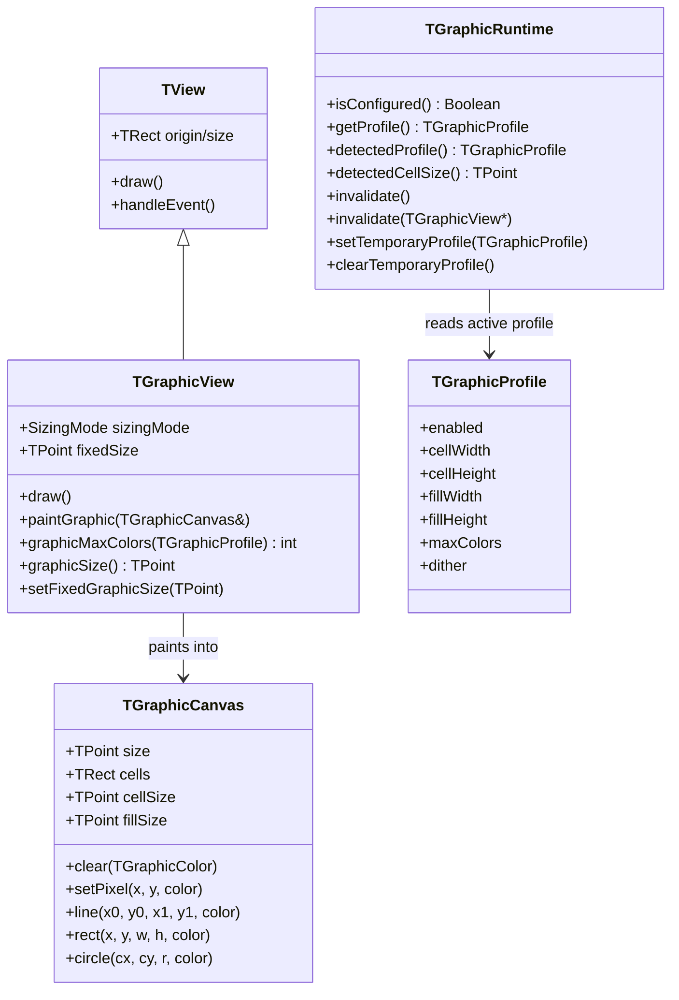
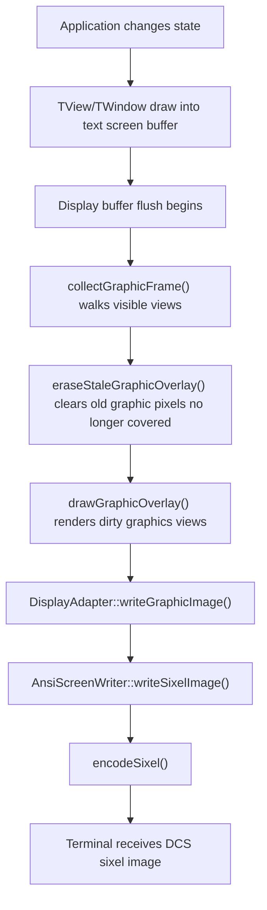
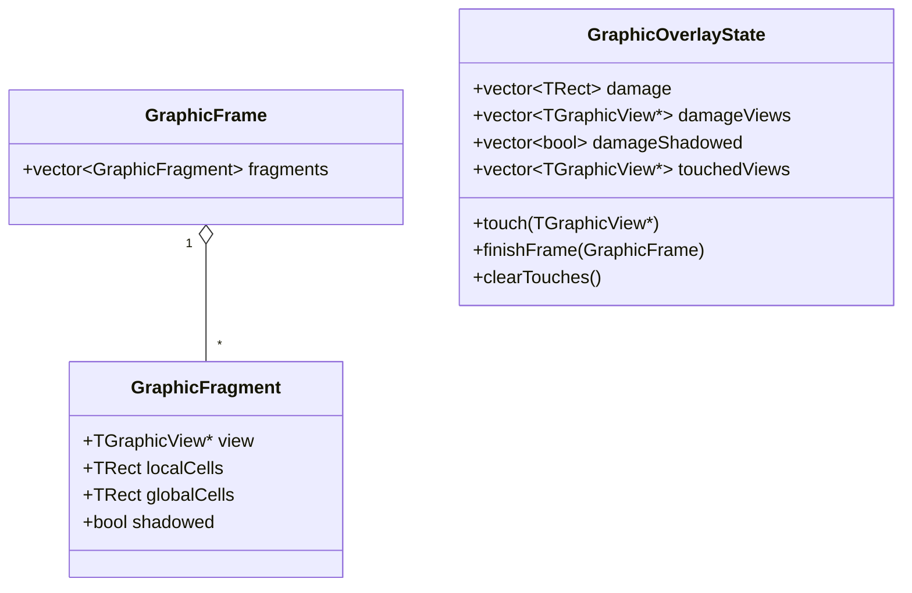
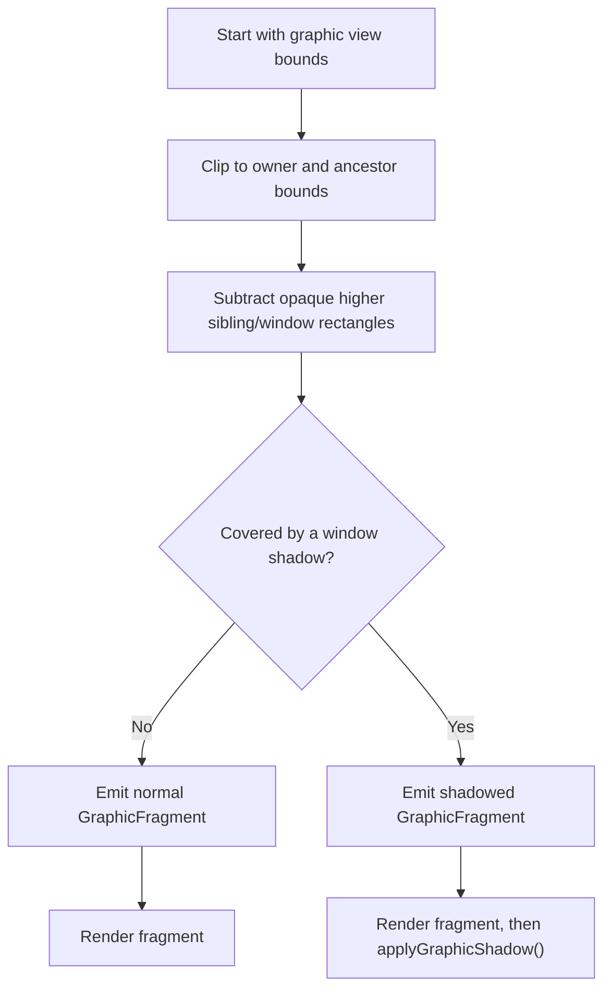
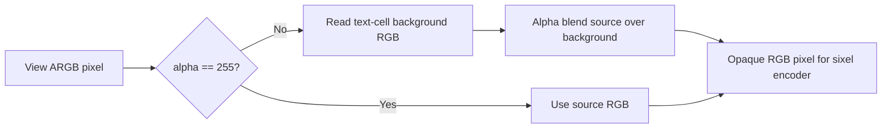
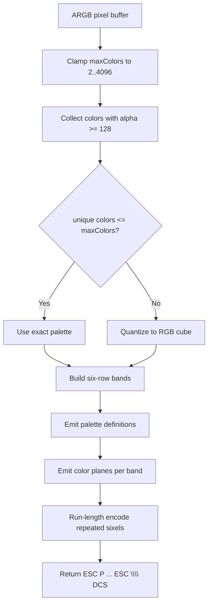
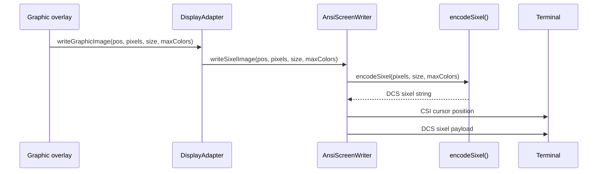
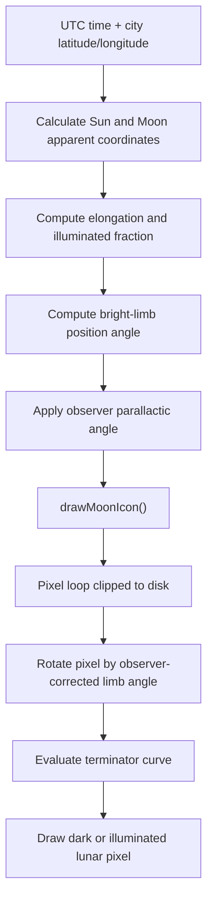

# Sixel Graphics Implementation

This directory contains publication material for the Turbo Vision sixel graphics
prototype. The screenshot in this directory shows the `sixeldemo` application
running in iTerm2 on macOS. The implementation extends Turbo Vision with raster
graphics views that are composited over the normal text UI and emitted as sixel
escape sequences.

The design goal is to keep the original Turbo Vision text rendering model
intact. Applications still build windows, dialogs, controls, palettes, and event
handling in the usual way. A graphics view is an additional view type that owns a
pixel buffer for its rectangle. The terminal receives ordinary text output first
and then receives sixel overlays for the visible graphics fragments.

This is currently a working prototype. It has been tested with iTerm2 on macOS
and with the native VT path used by
[Windows Terminal 1.22 or newer](https://github.com/microsoft/terminal/releases/tag/v1.22.10352.0).
Linux terminals have not been validated yet. On Windows, the display adapter
uses the standard DA1 (`ESC[c`) capability response and emits SIXEL only when
the console is in VT mode; legacy `conhost.exe` remains text-only.

## Source Map

The sixel work is split between public API, internal overlay management,
terminal encoding, configuration, and examples.

| Area | Files | Purpose |
| --- | --- | --- |
| Public graphics API | `include/tvision/graphics.h` | Defines `TGraphicCanvas`, `TGraphicView`, `TGraphicRuntime`, and `TGraphicProfile`. |
| Internal overlay state | `include/tvision/internal/graphics.h` | Tracks visible graphics fragments, damage, shadow state, and sixel profile detection data. |
| Canvas and view base implementation | `source/tvision/tgraphic.cpp` | Implements drawing primitives and the base `TGraphicView`. |
| Overlay compositor | `source/tvision/graphicsoverlay.cpp` | Finds visible graphics fragments, resolves overlap, applies shadows, composites alpha, and sends images to the display backend. |
| Configuration | `source/tvision/graphicsconfig.cpp` | Reads and writes the per-terminal sixel profile and exposes `TGraphicRuntime`. |
| Sixel encoder | `source/platform/sixel.cpp` | Converts ARGB pixels into sixel DCS escape sequences with palette reduction and run-length encoding. |
| Terminal writer | `source/platform/ansiwrit.cpp`, `source/platform/ncurdisp.cpp`, `source/platform/win32con.cpp` | Moves the cursor and writes sixel data through the Unix or Windows VT display adapter. |
| Windows capability parser | `include/tvision/internal/da1.h` | Parses primary device attributes and recognizes parameter 4 as SIXEL support. |
| Calibration utility | `examples/sixelcfg/sixelcfg.cpp` | Measures and stores cell size, fill size, and palette settings for the current terminal. |
| Demo application | `examples/sixeldemo/` | Demonstrates diagnostics, color ranges, image display, Mandelbrot, formula plotting, and world clocks with moon phase rendering. |

## Public Model

`TGraphicView` is the application-facing extension point. A subclass overrides
`paintGraphic(TGraphicCanvas &canvas)` and draws into an ARGB pixel buffer.
Turbo Vision handles clipping, overlap, window movement, shadows, and terminal
output outside the view.



The base `TGraphicView::draw()` clears its text cells. It does not draw a text
label behind the sixel output. This matters because terminal graphics are an
overlay: if a graphics fragment is later erased or partly shadowed, stale text
behind it must not leak through as a fake caption.

## Coordinate Model

Turbo Vision still lays out views in terminal cells. The graphics profile maps
those cells to pixels:

| Profile field | Meaning |
| --- | --- |
| `cellWidth`, `cellHeight` | Pixel size of a terminal character cell. |
| `fillWidth`, `fillHeight` | Pixel step used by sixel overlay output for one Turbo Vision cell. Usually equal to the cell size. |
| `maxColors` | Maximum palette entries used when encoding one sixel image. |

For a fill-sized graphics view, the pixel buffer size is derived from the view's
current cell size:

```text
pixel_width  = view_width_in_cells  * fillWidth
pixel_height = view_height_in_cells * fillHeight
```

For a fixed-sized graphics view, the view can request a fixed pixel size. The
overlay code then places that content inside a background-filled output buffer
matching the visible cell footprint.

## Frame Pipeline

The renderer is intentionally layered. Text drawing remains the primary Turbo
Vision frame. Sixel output is produced after the text screen buffer has been
updated.



The overlay state is stored in `GraphicOverlayState`. It records:

| Field | Role |
| --- | --- |
| `damage` | Cell rectangles that need graphics refresh. |
| `damageViews` | Specific graphics views invalidated by `TGraphicRuntime::invalidate(view)`. |
| `damageShadowed` | Whether the damaged region involved shadow compositing. |
| `touchedViews` | Views that were rendered or affected in the previous frame. |
| `touched`, `allTouched` | Coarse flags for full or partial graphics refresh. |

`TGraphicRuntime::invalidate()` is the application-level way to request redraw.
Animated views such as the live clock call it when their pixel content changes.
Interactive views call `TGraphicRuntime::invalidate(this)` when only one view
needs to be repainted.

## Visibility, Overlap, And Shadows

Turbo Vision windows can overlap and cast shadows. A graphics view therefore
cannot simply redraw its full rectangle every frame. The overlay compositor
builds a list of visible fragments. Each fragment describes which cell rectangle
of a graphics view is visible and where that fragment appears on the terminal.



The visible area is computed by walking the view tree and clipping each graphics
view against its ancestors. Higher views subtract their covered rectangles from
lower graphics views. Shadow rectangles are handled separately so that graphics
under a window shadow remain visible but darkened.



Shadow drawing is done in pixel space after the graphics view has rendered. The
current implementation darkens visible pixels under a shadow to 42 percent of
their original red, green, and blue values while preserving the alpha channel.
This mirrors the text UI behavior: a shadow changes the apparent brightness of
what is underneath instead of replacing it with an opaque rectangle.

The compositor also erases stale graphics output. If a window moves, resizes, or
covers a graphics view, the terminal may still contain sixel pixels from the
previous frame. `eraseStaleGraphicOverlay()` fills those stale rectangles with
solid pixels derived from the underlying Turbo Vision text screen buffer
background colors. This makes the overlay behave like a real part of the window
system instead of a permanent terminal drawing.

## Alpha And Background Color

Graphics views draw ARGB pixels. Before sixel encoding, transparent or partially
transparent pixels are resolved against the Turbo Vision background color for
the cell they occupy. The background color comes from the current text screen
cell attributes, so dialog palettes, blue application backgrounds, and shadowed
regions all influence the final raster output.



This alpha resolve step is important for true-color image display and for custom
drawn demos such as the clock. Without it, transparent image pixels can expose
terminal palette defaults or unintended common colors instead of the expected
window background.

## Sixel Encoding

The platform encoder receives an opaque ARGB buffer and converts it into a
sixel Device Control String. The encoder supports exact palettes for small color
sets and quantized palettes for larger images.



Sixel images are encoded in bands of six pixel rows. For each band, the encoder
emits one plane per active palette color. A single sixel character contains six
vertical bits, so a column of six pixels can be represented by one printable
character. Runs of four or more equal sixel characters are compressed with the
standard sixel `!count` repeat form.

Transparent pixels are skipped by the encoder. In normal overlay rendering the
compositor has already resolved alpha against the cell background, so skipped
pixels mainly matter for lower-level encoder robustness.

## Display Backend

The display backend moves the terminal cursor to the top-left cell of the
fragment and writes the encoded sixel image. The cursor movement uses the normal
ANSI writer, then the sixel DCS is sent as raw terminal output.



After sixel output, the ANSI writer invalidates its cached text attributes and
cursor position. That prevents later text drawing from assuming the terminal is
still in the same state as before the graphics escape sequence.

## Configuration And Calibration

The runtime profile is loaded from a small per-terminal configuration file.
`examples/sixelcfg` is the companion utility for creating or updating this
profile.

Default config path:

```text
$XDG_CONFIG_HOME/tvision/sixel.conf
```

Fallback config path:

```text
$HOME/.config/tvision/sixel.conf
```

On native Windows, when neither XDG nor `HOME` supplies a path, the fallback is:

```text
%APPDATA%\tvision\sixel.conf
```

Useful environment overrides:

| Variable | Role |
| --- | --- |
| `TVISION_SIXEL_CONFIG` | Overrides the config file path. |
| `TVISION_SIXEL_PROFILE` | Overrides the profile key used inside the config file. |

The profile key is otherwise derived from terminal environment values such as
`TERM_PROGRAM`, `TERM_PROGRAM_VERSION`, `TERM`, and `COLORTERM`. This allows
different terminals or profiles to keep separate sixel cell measurements.

The stored profile contains:

```ini
[profile-key]
enabled=1
cell_width_px=8
cell_height_px=16
fill_width_px=8
fill_height_px=16
max_colors=256
```

The extra `detected_*` lines written by `sixelcfg` are diagnostic metadata.
They are not required for rendering but make it easier to understand which
terminal environment produced the calibration.

### Windows capability detection

The Win32 display adapter enables graphics only on Turbo Vision's ANSI/VT
output path. The first capability check sends the primary device attributes
request (`ESC[c`) and looks for parameter 4 in the response. A valid response
without parameter 4 keeps graphics disabled. If the query is unanswered or
malformed, `WT_SESSION` and `TERM_PROGRAM` provide a conservative fallback for
Windows Terminal. The result is cached for the lifetime of the display adapter.

`TGraphicRuntime::detectedProfile()` exposes the profile resolved by the active
display adapter, including this Windows probe. Applications can merge their own
palette, dithering, or sizing preferences into that profile before installing a
temporary profile. `TGraphicRuntime::detectedCellSize()` independently exposes
the terminal's live character-cell size.

## Demo Views

The demo application shows several ways to use `TGraphicView`:

| View | Purpose |
| --- | --- |
| Diagnostic view | Shows geometry, profile, and rendering state. |
| Color range view | Exercises palette size, gradients, and quantization behavior. |
| Image view | Loads raster images and demonstrates palette and true-color handling. |
| Mandelbrot view | Renders a computational image and reacts to resize/interaction. |
| Formula plotter | Draws axes, grid lines, ticks, labels, and a parsed mathematical function. |
| World clock | Draws an analog clock, city-specific rule-based local time, and an observer-oriented moon phase. |

The formula plotter and moon phase code live in separate source files so the
main demo remains readable:

```text
examples/sixeldemo/formulaplot.h
examples/sixeldemo/formulaplot.cpp
examples/sixeldemo/moonphase.h
examples/sixeldemo/moonphase.cpp
```

## Moon Drawing

The world clock uses the same graphics pipeline as the rest of the demo. The
moon calculation is self-contained and has no additional dependencies. It uses
Meeus-style formulas for Julian dates, solar and lunar coordinates, illuminated
fraction, bright-limb angle, and observer correction through local sidereal time
and parallactic angle.

The city clock uses embedded current DST rules instead of a single fixed offset.
The demo currently includes rules for United States cities, London/Berlin,
Sydney, and fixed-offset cities that do not observe DST. Transition instants are
converted to UTC before comparison, so the fall-back hour is handled without
ambiguous local-time comparisons.

The renderer draws the moon pixel by pixel:

1. Clip to a circular lunar disk.
2. Draw a dark base disk.
3. Rotate each pixel into the moon bright-limb coordinate system.
4. Use the phase angle to decide whether that pixel is on the illuminated side
   of the terminator.
5. Fill illuminated pixels with a warm yellow-white color.
6. Add subtle shading and a rim so the disk remains readable at small sizes.



In clock mode the moon icon is drawn before the hour, minute, and second hands.
That makes the moon part of the clock face rather than an overlay on top of the
hands. Clicking the graphic area toggles to a moon detail view with the city,
local rule-based time, phase name, illuminated percentage, moon age, altitude,
azimuth, and limb angle.

## Adding A New Graphics View

A new graphics view normally follows this pattern:

```cpp
class TMyGraphicView : public TGraphicView
{
public:
    TMyGraphicView(const TRect &bounds) :
        TGraphicView(bounds, fillGraphic)
    {
    }

    void paintGraphic(TGraphicCanvas &canvas) override
    {
        canvas.clear({255, 255, 255});
        canvas.line(0, 0, canvas.size.x - 1, canvas.size.y - 1, {0, 0, 0});
    }
};
```

Use `TGraphicRuntime::invalidate(this)` when the view content changes. Use
`TGraphicRuntime::invalidate()` when a global profile change or full graphics
refresh is needed. Prefer the existing canvas primitives for simple graphics and
write directly to `canvas.data()` only when a pixel algorithm needs that control.

## Current Limitations

The prototype is intentionally conservative and has a few known boundaries:

| Limitation | Current state |
| --- | --- |
| Terminal support | Tested on iTerm2/macOS and Windows Terminal 1.22+. Linux terminals still need validation; legacy Windows `conhost.exe` is text-only. |
| Capability detection | Interactive Windows VT consoles are queried with DA1 (`ESC[c`); a short timeout falls back to Windows Terminal environment markers. Profiles remain manually configurable through `sixelcfg`. |
| Color limits | The encoder respects `maxColors`; large images may be quantized depending on the selected profile. |
| Cell calibration | Correct output depends on matching terminal font cell dimensions. |
| Performance | Views are rendered into CPU memory and encoded per dirty fragment. Very large animated images can be expensive. |
| Astronomy precision | Moon rendering targets polished visual correctness for modern dates, not observatory-grade ephemerides. |
